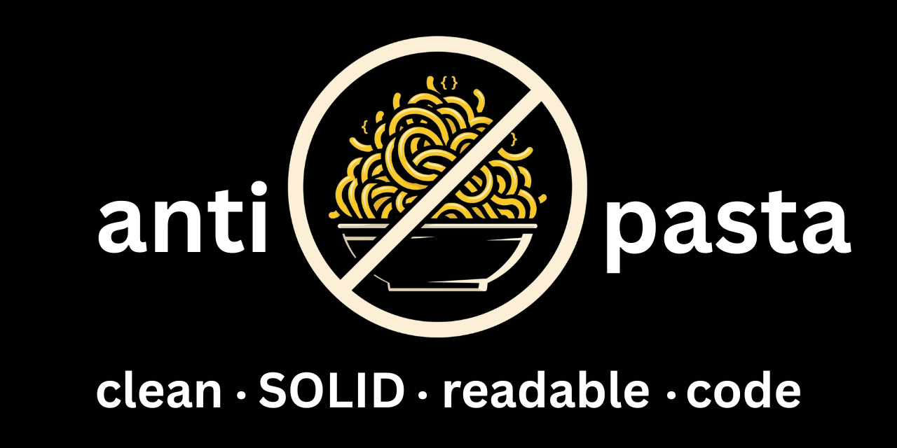

# antipasta

A code quality static analysis library that covers a wide range of metrics, including:

- lines of code
- complexity
- readability
- SOLID adherence
- DRYness
- VCS-based metrics
- 

## What is antipasta?

antipasta analyzes your source code files and measures various complexity metrics, comparing them against configurable thresholds. If any metrics exceed their thresholds, antipasta reports violations and exits with a non-zero status code, making it suitable for CI/CD pipelines.

antipasta has full Python analysis and lightweight JavaScript/TypeScript support in the metrics and report pipeline through lizard for cyclomatic complexity and line-count metrics.

## Why use antipasta?

Complex code is harder to understand, test, and maintain. By enforcing limits on complexity metrics, you can:

-   Catch overly complex functions before they're merged
-   Maintain consistent code quality standards across your team
-   Identify refactoring opportunities
-   Reduce technical debt over time

### What makes antipasta different than other code complexity tools like `radon`?

I have no idea, I've never used them - this library is mostly a combination of [radon](https://github.com/rubik/radon) and [complexipy](https://github.com/rohaquinlop/complexipy) with an amazing CLI.

## Installation

### From PyPI (Recommended)

```bash
pip install antipasta
```

### Development Installation

```bash
# Clone the repository
git clone https://github.com/hesreallyhim/antipasta.git
cd antipasta

# Install with development dependencies (automatically creates venv)
make install-dev
```

### Requirements

-   Python 3.11 or higher

## Quick Start

### Generate Configuration

If you don't have a configuration file yet, generate one with sensible defaults:

```bash
# Interactive mode - prompts for your preferences
antipasta config generate

# Non-interactive mode - uses defaults
antipasta config generate --non-interactive

# Start from a preset
antipasta config generate --preset readable --non-interactive

# Generate to a custom location
antipasta config generate --output my-config.yaml
```

The interactive mode will guide you through setting up:
- Complexity thresholds (cyclomatic, cognitive, maintainability)
- Advanced Halstead metrics (optional)
- Python language setup; JavaScript/TypeScript can be configured manually for cyclomatic complexity and line counts
- Ignore patterns (enter one at a time, with default test patterns optional)
- Gitignore integration settings

Presets provide smaller starting points for common tradeoffs such as readability, compactness, architecture, and test-suite maintainability. See [`docs/presets.md`](docs/presets.md) for the preset list and merge rules.

The interactive mode validates all inputs and shows valid ranges:
- **Cyclomatic Complexity**: 1-50 (recommended: 10)
- **Cognitive Complexity**: 1-100 (recommended: 15)
- **Maintainability Index**: 0-100 (recommended: 50)
- **Halstead Volume**: 1-100000 (recommended: 1000)
- **Halstead Difficulty**: 0.1-100 (recommended: 10)
- **Halstead Effort**: 1-1000000 (recommended: 10000)

If you enter an invalid value, you'll be prompted to try again with helpful error messages.

#### Interactive Configuration Example

When running `antipasta config generate`, you'll see prompts like:

```
Welcome to antipasta configuration generator!
==================================================

Let's set up your code quality thresholds:
----------------------------------------
  ℹ️  Range: 1-50 (lower is stricter). Recommended: 10
Maximum cyclomatic complexity per function [10]:

File patterns to ignore during analysis:
----------------------------------------
Include default test file patterns? (**/test_*.py, **/*_test.py, **/tests/**) [Y/n]: y
  ✓ Added default test patterns

Enter additional patterns to ignore (one per line, press Enter with no input to finish):
Pattern (or press Enter to continue): *.pyc
  ✓ Added: *.pyc
Pattern (or press Enter to continue):
  Total patterns to ignore: 4
```

## Available Commands

antipasta provides the following commands:

| Command | Description | Default Behavior |
|---------|-------------|------------------|
| `config` | Manage configuration files (subcommands: generate, validate, view) | Group command for configuration management |
| `config generate` | Generate a configuration file interactively or with defaults | Creates `.antipasta.yaml` in current directory |
| `config validate` | Validate a configuration file | Validates `.antipasta.yaml` if no file specified |
| `config view` | View configuration in various formats | Shows configuration summary |
| `metrics` | Analyze code metrics for specified files | Uses `.antipasta.yaml` config, shows helpful message if missing |
| `stats` | Collect and display code metrics statistics | Analyzes files matching the specified pattern |
| `report` | Generate a visual complexity report (offline HTML or JSON) | Writes a single self-contained HTML file |
| `vcs` | Mine git history for churn, coupling, hotspots, and suite-health ratios | Uses the current repository; hotspot join is skipped unless a snapshot is supplied |
| `test-health` | Analyze coverage contexts for test redundancy and blast radius | Reads coverage.py data recorded with `--cov-context=test` |

## Basic Usage

### Analyze Files

```bash
# Analyze specific files (uses .antipasta.yaml by default)
antipasta metrics --files src/main.py src/utils.py

# Analyze all supported files in a directory
antipasta metrics --directory src/

# Use a custom configuration file
antipasta metrics --config my-config.yaml --directory .

# Quiet mode (only show violations)
antipasta metrics --quiet --directory src/

# Output results in JSON format
antipasta metrics --format json --directory src/
```

**Note**: If `.antipasta.yaml` doesn't exist, antipasta will:
1. Show a helpful message: "Configuration file '.antipasta.yaml' not found. Run 'antipasta config generate' to create a configuration file."
2. Continue with default settings for the analysis

### Visual Report

```bash
# Generate a self-contained offline HTML report (treemap, per-function tables)
antipasta report --directory src/ --output report.html --open

# Emit the raw JSON snapshot instead, plus the 10 worst functions on the terminal
antipasta report --directory src/ --format json --output snapshot.json --top 10

# Trend workflow: snapshot, refactor, then diff — delta-colored tiles, a regressions
# table in the HTML, and a terminal summary of what your change did to complexity
antipasta report --directory src/ --output report.html --save-baseline   # writes report.baseline.json
antipasta report --directory src/ --output report.html --baseline report.baseline.json
```

The HTML report is a single file with no network dependencies (d3 is embedded),
so it can be opened from any `file://` URL or attached to a CI run. Tile area is
source lines of code; tile color is the selected metric against its configured
threshold. JavaScript/TypeScript files are analyzed via lizard (cyclomatic
complexity and line counts); metrics a language lacks render neutral, never
"good".

### Validate Configuration

```bash
# Check if your configuration file is valid (defaults to .antipasta.yaml)
antipasta config validate

# Validate a specific configuration file
antipasta config validate my-config.yaml
```

### View Configuration

```bash
# View configuration summary (default)
antipasta config view

# View raw YAML content
antipasta config view --format raw

# View as JSON
antipasta config view --format json

# View as a formatted table
antipasta config view --format table

# View specific config file
antipasta config view --path custom-config.yaml
```

### Collect Statistics

```bash
# Get overall statistics for Python files
antipasta stats --pattern "**/*.py"

# Statistics grouped by directory
antipasta stats --pattern "**/*.py" --by-directory

# Statistics grouped by module (Python packages)
antipasta stats --pattern "**/*.py" --by-module

# Include additional metrics in statistics
antipasta stats --pattern "**/*.py" --metric cyclomatic_complexity --metric cognitive_complexity

# Save results to a file
antipasta stats --pattern "**/*.py" --output report.txt
antipasta stats --pattern "**/*.py" --format json --output report.json
antipasta stats --pattern "**/*.py" --format csv --output report.csv

# Generate ALL report formats at once (9 files from 1 analysis!)
antipasta stats --pattern "**/*.py" --format all --output ./reports/
# This creates:
#   - stats_overall.{json,csv,txt}
#   - stats_by_directory.{json,csv,txt}
#   - stats_by_module.{json,csv,txt}
```

### Version-Control Mining

```bash
# Mine the last 90 days of git history
antipasta vcs

# Join hotspots to a previously generated report snapshot
antipasta report --directory src/antipasta --format json --output .cache/antipasta-snapshot.json
antipasta vcs --snapshot .cache/antipasta-snapshot.json

# Use a different history window or emit JSON
antipasta vcs --window 30 --format json
```

### Test-Suite Health

```bash
# First collect coverage contexts
pytest --cov=src/antipasta --cov-context=test

# Then analyze redundant tests and blast radius
antipasta test-health --coverage-file .coverage
antipasta test-health --coverage-file .coverage --format json
```

## Configuration

antipasta uses YAML configuration files. By default, it looks for `.antipasta.yaml` in the current directory.

### Example Configuration

```yaml
# antipasta configuration file
# Generated by: antipasta config generate

# Default thresholds for all languages
defaults:
  max_cyclomatic_complexity: 10.0
  max_cognitive_complexity: 15.0
  min_maintainability_index: 50.0
  # Halstead metrics (advanced)
  max_halstead_volume: 1000.0
  max_halstead_difficulty: 10.0
  max_halstead_effort: 10000.0

# Language-specific configurations
languages:
  - name: python
    extensions:
      - .py
    metrics:
      - type: cyclomatic_complexity
        threshold: 10.0
        comparison: "<="

      - type: cognitive_complexity
        threshold: 15.0
        comparison: "<="

      - type: maintainability_index
        threshold: 50.0
        comparison: ">="

      - type: halstead_volume
        threshold: 1000.0
        comparison: "<="

      - type: halstead_difficulty
        threshold: 10.0
        comparison: "<="

      - type: halstead_effort
        threshold: 10000.0
        comparison: "<="

# Files and patterns to ignore during analysis
ignore_patterns:
  - "**/test_*.py"
  - "**/*_test.py"
  - "**/tests/**"
  - "**/__pycache__/**"

# Whether to use .gitignore file for excluding files
use_gitignore: true

# Strictness profile for profile-aware derived metrics
profile: standard
```

### Configuration Structure

-   **defaults**: Default thresholds used when language-specific configuration is not provided
-   **languages**: Language-specific configurations
    -   **name**: Language identifier (`python`, `javascript`, or `typescript`)
    -   **extensions**: File extensions to associate with this language
    -   **metrics**: List of metrics to check
        -   **type**: The metric type (see Metrics section below)
        -   **threshold**: The threshold value
        -   **comparison**: How to compare the metric value with the threshold
        -   **enabled**: (optional) Whether to check this metric (default: true, can be omitted)
-   **ignore_patterns**: Additional gitignore-style patterns for files to skip (combined with .gitignore if `use_gitignore` is true)
-   **use_gitignore**: Whether to automatically use patterns from `.gitignore` (default: true)
-   **preset**: Optional coarse metric bundle (`balanced`, `readable`, `compact`, `architecture`, or `testing`)
-   **profile**: Strictness profile for profile-aware derived metrics (`standard`, `relaxed`, or `extreme`)
-   **tree_shape**, **import_graph**, **narrative**, **duplication**: Optional blocks that turn project-scoped informational metrics into configured gates

### Comparison Operators

-   `<=` - Metric value must be less than or equal to threshold
-   `<` - Metric value must be less than threshold
-   `>=` - Metric value must be greater than or equal to threshold
-   `>` - Metric value must be greater than threshold
-   `==` - Metric value must equal threshold
-   `!=` - Metric value must not equal threshold

## Metrics Explained

### Lines of Code Metrics

-   **LOC**: Total lines of code
-   **SLOC**: Source lines of code (excluding comments and blanks)
-   **LLOC**: Logical lines of code
-   **Comment Lines**: Number of comment lines
-   **Blank Lines**: Number of blank lines

### Cyclomatic Complexity

Measures the number of linearly independent paths through a function. Higher values indicate more complex control flow.

-   **Good**: 1-10 (simple, easy to test)
-   **Moderate**: 11-20 (more complex, harder to test)
-   **High**: 21+ (very complex, consider refactoring)

Example of high complexity:

```python
def process_data(data, mode, validate, transform):
    if validate:
        if not data:
            return None
        if mode == "strict":
            if not isinstance(data, dict):
                raise ValueError("Invalid data")

    if transform:
        if mode == "simple":
            return data.lower()
        elif mode == "complex":
            if validate:
                return data.upper()
            else:
                return data.title()

    return data
```

### Halstead Metrics

Based on the number of operators and operands in code:

-   **Volume**: Program size based on the number of operations
-   **Difficulty**: How hard the code is to understand
-   **Effort**: Mental effort required to understand the code
-   **Time**: Estimated time to implement (in seconds)
-   **Bugs**: Estimated number of bugs (Volume / 3000)

### Maintainability Index

A composite metric (0-100) that considers cyclomatic complexity, lines of code, and Halstead volume. Higher values indicate more maintainable code.

-   **Good**: 50-100 (maintainable)
-   **Moderate**: 20-49 (moderately maintainable)
-   **Low**: 0-19 (difficult to maintain)

### Cognitive Complexity

Measures how difficult code is to understand, focusing on human comprehension rather than execution paths. Unlike cyclomatic complexity, it penalizes nested structures more heavily.

-   **Good**: 1-15 (easy to understand)
-   **Moderate**: 16-30 (requires careful reading)
-   **High**: 31+ (difficult to understand, consider refactoring)

Key differences from cyclomatic complexity:
-   Heavily penalizes nested control structures
-   Considers break/continue statements in loops
-   Better represents actual cognitive load

## Exit Codes

-   **0**: Success - all metrics pass their thresholds (for `metrics`), or configuration is valid (for `validate-config`)
-   **1**: Error - invalid configuration, processing errors, or validation failures
-   **2**: Violations found (for `metrics` command) or invalid command arguments (for all commands)

This makes antipasta suitable for CI/CD pipelines:

```bash
# Basic CI pipeline usage
antipasta metrics --directory src/ --quiet || exit 1

# First-time setup in CI
if [ ! -f .antipasta.yaml ]; then
    antipasta config generate --non-interactive
fi
antipasta metrics --directory src/

# Validate configuration before running metrics
antipasta config validate && antipasta metrics --directory src/
```

## Example Output

### Standard Output

```
Using configuration: .antipasta.yaml
Analyzing 3 files...

======================================================================
METRICS ANALYSIS SUMMARY
======================================================================
Total files analyzed: 3
Files with violations: 1
Total violations: 2

Violations by type:
  - cyclomatic_complexity: 1
  - maintainability_index: 1

----------------------------------------------------------------------
VIOLATIONS FOUND:
----------------------------------------------------------------------
❌ src/complex.py:15 (process_data): Cyclomatic Complexity is 12.00 (threshold: <= 10.0)
❌ src/complex.py: Maintainability Index is 45.23 (threshold: >= 50.0)

✗ Code quality check FAILED
```

### Quiet Mode Output

```
----------------------------------------------------------------------
VIOLATIONS FOUND:
----------------------------------------------------------------------
❌ src/complex.py:15 (process_data): Cyclomatic Complexity is 12.00 (threshold: <= 10.0)
❌ src/complex.py: Maintainability Index is 45.23 (threshold: >= 50.0)

✗ Code quality check FAILED
```


## Learning Resources

### Code Complexity Reduction Tutorial

If you're new to code complexity metrics or want to learn how to reduce complexity in your code, check out our comprehensive tutorial:

📚 **[Code Complexity Reduction Tutorial](DEMOS/TUTORIAL/README.md)**

This hands-on tutorial walks you through:
- Understanding what makes code complex
- Step-by-step techniques to reduce complexity
- Real examples showing a 90% reduction in cognitive complexity
- When to stop refactoring (perfect metrics vs practical code)

The tutorial includes 5 progressive versions of the same code, demonstrating techniques like:
1. **Early returns** - The simplest and most effective technique
2. **Function extraction** - Breaking down large functions
3. **Data classes** - Reducing parameter lists
4. **Configuration objects** - Eliminating magic numbers
5. **Enterprise patterns** - When and how to use advanced patterns

Perfect for developers who want to write more maintainable code or teams establishing code quality standards.

## Statistics Collection

The `antipasta stats` command provides comprehensive statistical analysis of your codebase:

### Features

- **File-level statistics**: Average, min, max lines of code per file
- **Directory grouping**: See metrics broken down by folder
- **Module grouping**: Group by Python packages
- **Multiple metrics**: Include any supported metric in the analysis
- **Export formats**: Table (human-readable), JSON, CSV

### Examples

```bash
# Basic statistics for all Python files
antipasta stats --pattern "**/*.py"

# Group by directory to find large folders
antipasta stats --pattern "**/*.py" --by-directory

# Group by Python module
antipasta stats --pattern "**/*.py" --by-module

# Include complexity metrics
antipasta stats --pattern "**/*.py" \
    --metric cyclomatic_complexity \
    --metric cognitive_complexity \
    --metric maintainability_index

# Multiple file patterns
antipasta stats --pattern "src/**/*.py" --pattern "tests/**/*.py"

# Export for further analysis
antipasta stats --pattern "**/*.py" --format csv > metrics.csv
antipasta stats --pattern "**/*.py" --format json | jq '.files.avg_loc'
```

### Output Example

```
============================================================
CODE METRICS STATISTICS
============================================================

FILE STATISTICS:
  Total files: 23
  Total LOC: 1,947
  Average LOC per file: 114.5
  Min LOC: 4
  Max LOC: 456
  Standard deviation: 123.3

CYCLOMATIC COMPLEXITY STATISTICS:
  Count: 81
  Average: 4.21
  Min: 1.00
  Max: 22.00
```

### Use Cases

1. **Track codebase growth**: Monitor total LOC over time
2. **Identify large files**: Find files that exceed size thresholds
3. **Compare modules**: See which parts of your code are most complex
4. **Team metrics**: Compare complexity across different team areas
5. **Refactoring targets**: Find directories with high average complexity

### Project Structure

```
antipasta/
├── cli/              # Command-line interface
├── core/             # Models, derivations, mining, and snapshot storage
│   ├── derive/       # Project-scoped structural metrics
│   ├── mining/       # VCS and coverage-matrix analytics
│   ├── model/        # Config, detector, metric, and violation models
│   └── store/        # Cache, snapshot, diff, and treemap helpers
├── report/           # Offline HTML report rendering and assets
├── runners/          # Language-specific analyzers
│   ├── javascript/   # JS/TS analysis via lizard
│   └── python/       # Python analysis via Radon, Complexipy, and house style
└── schemas/          # Packaged JSON schema
```

## Current Limitations

1. **Python has the broadest metric coverage**: JavaScript and TypeScript currently use lizard for cyclomatic complexity and line counts.
2. **Some metrics are scope-specific**: Several metrics are function-level, while newer structural metrics report at class, module, project, or artifact scope.
3. **Cognitive Complexity Requires Complexipy**: The cognitive complexity metric requires the optional `complexipy` package to be installed.

## Future Enhancements

-   Pre-commit hook integration
-   Git hook support
-   GitHub Actions integration
-   VS Code extension

## Contributing

Contributions are welcome! Please:

1. Fork the repository
2. Create a feature branch
3. Add tests for new functionality
4. Ensure all tests pass
5. Submit a pull request

## Release Process

antipasta releases are managed with Release Please and GitHub trusted publishing.

Use conventional commit-style PR titles so Release Please can infer the correct version bump:

- `fix: ...` for patch releases
- `feat: ...` for minor releases
- `feat!: ...` or a `BREAKING CHANGE:` footer for major releases

After changes are merged to `main`, Release Please opens or updates a release PR. Merging that release PR creates the GitHub release and triggers the `Publish to PyPI` workflow.

Useful maintainer command:

```bash
make release-dry-run  # Build and inspect distributions without uploading
```

For TestPyPI or production publishing, use the manual `Publish to PyPI` workflow dispatch in GitHub Actions. See [CONTRIBUTING.md](CONTRIBUTING.md) for contributor setup and release notes.

## License

[Add your license here]

## Acknowledgments

-   [Radon](https://github.com/rubik/radon) for Python code metrics
-   Inspired by various code quality tools like ESLint, Pylint, and SonarQube
