# Antipasta Architecture Diagram

## Current Architecture as Implemented

```mermaid
graph TB
    subgraph "CLI Layer - src/antipasta/cli/"
        subgraph "Commands"
            metrics[metrics/metrics.py<br/>Quality Enforcement]
            stats[stats/command.py<br/>Statistics Analysis]
            config_cmds[config/*.py<br/>Config Commands]
        end

        subgraph "Metrics Module - cli/metrics/"
            m_config[metrics_utils_config.py]
            m_override[metrics_utils_override.py]
            m_analysis[metrics_utils_analysis.py]
            m_output[metrics_utils_output.py]
        end

        subgraph "Stats Module - cli/stats/"
            subgraph "collection/"
                s_file_collect[file_collection.py]
                s_metrics[metrics.py]
                s_analysis[analysis.py]
            end
            subgraph "aggregation/"
                s_directory[directory.py]
                s_module[module.py]
            end
            subgraph "output/"
                s_display[display.py]
            end
            s_config[config.py]
            s_utils[utils.py]
        end
    end

    subgraph "Core Layer - src/antipasta/core/"
        aggregator[aggregator.py<br/>Orchestrator]
        detector[detector.py<br/>Language Detection]
        core_config[config.py<br/>Configuration]
        violations[violations.py<br/>Threshold Checking]
        metric_models[metric_models.py<br/>Data Models]
        config_override[config_override.py<br/>Override Logic]
    end

    subgraph "Runners Layer - src/antipasta/runners/"
        base_runner[base.py<br/>Abstract Interface]
        subgraph "python/"
            radon[radon.py<br/>Cyclomatic/Halstead/LOC]
            complexipy[complexipy_runner.py<br/>Cognitive Complexity]
        end
        js_placeholder[javascript/<br/>Empty]
        ts_placeholder[typescript/<br/>Empty]
    end

    subgraph "External Tools"
        radon_tool[Radon Library]
        complexipy_tool[Complexipy CLI]
    end

    %% Command Entry Points
    metrics --> m_analysis
    stats --> s_config
    config_cmds --> core_config

    %% Metrics Flow
    m_config --> core_config
    m_override --> config_override
    m_analysis --> aggregator
    m_output --> violations

    %% Stats Flow
    s_config --> aggregator
    s_config --> detector
    s_analysis --> aggregator
    s_file_collect --> detector
    s_metrics --> s_utils
    s_directory --> s_metrics
    s_module --> s_directory
    s_display --> s_utils

    %% Core Orchestration
    aggregator --> detector
    aggregator --> core_config
    aggregator --> violations
    aggregator --> radon
    aggregator --> complexipy
    detector --> core_config
    violations --> metric_models

    %% Runner Implementation
    radon --> base_runner
    complexipy --> base_runner
    radon --> radon_tool
    complexipy --> complexipy_tool

    %% Styling
    classDef command fill:#e1f5fe,stroke:#01579b,stroke-width:3px
    classDef core fill:#fff3e0,stroke:#e65100,stroke-width:3px
    classDef runner fill:#f3e5f5,stroke:#4a148c,stroke-width:2px
    classDef external fill:#ffebee,stroke:#b71c1c,stroke-width:1px,stroke-dasharray: 5 5
    classDef placeholder fill:#f5f5f5,stroke:#9e9e9e,stroke-width:1px,stroke-dasharray: 3 3

    class metrics,stats,config_cmds command
    class aggregator,detector,core_config,violations,metric_models,config_override core
    class base_runner,radon,complexipy runner
    class radon_tool,complexipy_tool external
    class js_placeholder,ts_placeholder placeholder
```



## Key Architectural Patterns

### 1. Hub-and-Spoke via Core
- **MetricAggregator** is the central hub
- All metric calculation flows through it
- No direct CLI → Runner connections

### 2. Data Flow Paths

#### Metrics Command Path:
```
User → metrics.py → MetricAggregator → Runners → Violations → Output
                           ↓
                    Config + Filters
```

#### Stats Command Path:
```
User → stats.py → MetricAggregator → Runners → Statistics → Display
                         ↓
                  Config + Detector
```

### 3. Dependency Direction
```
CLI ──imports──> Core <──imports── Runners
         ↓                            ↑
    (uses API)                  (implements)
         ↓                            ↑
    Never sees                  Never sees
     Runners                    CLI or Core
```

### 4. Configuration Flow
```
CLI Layer
    ↓ (creates config + overrides)
Core Layer
    ↓ (applies filters, thresholds)
Runners
    (receive only what they need)
```

## Directory Mapping

```
src/antipasta/
├── cli/                    # User-facing commands
│   ├── metrics/           # Enforcement flow
│   ├── stats/             # Analytics flow
│   └── config/            # Config management
├── core/                  # Central orchestration
│   ├── aggregator.py      # THE HUB
│   ├── detector.py        # Language routing
│   └── config.py          # Config management
└── runners/               # Metric calculation
    └── python/            # Active implementations
        ├── radon.py
        └── complexipy_runner.py
```

## Why This Architecture Works

1. **Single Responsibility**: Each layer has ONE job
2. **Loose Coupling**: Layers communicate through interfaces
3. **High Cohesion**: Related functionality grouped together
4. **Dependency Inversion**: CLI depends on abstractions (Core), not concretions (Runners)
5. **Open/Closed**: Can add new runners without changing Core's interface

The Core layer truly acts as the **orchestration layer** that coordinates everything!