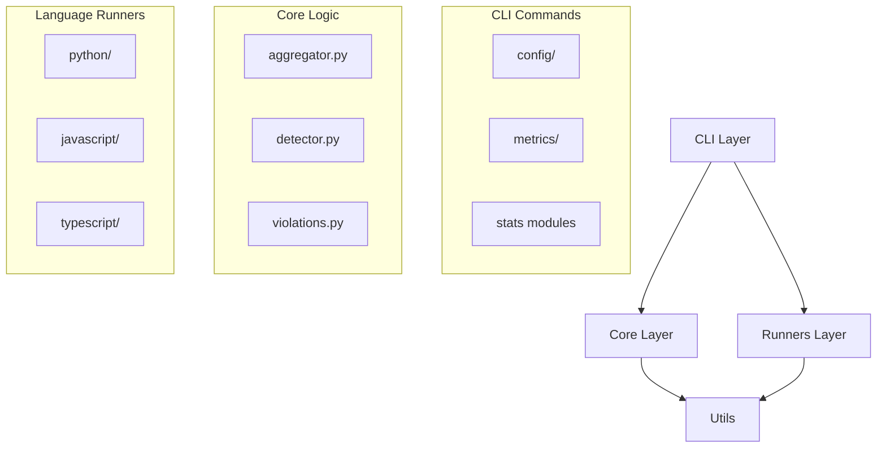

# Antipasta Project Structure Analysis

## Overview
The antipasta project is a Python code quality enforcement tool with a modular architecture. The codebase shows evidence of ongoing refactoring from a monolithic script to a well-organized package structure.

## Directory Tree Visualization

```
antipasta/
├── src/antipasta/          # Main package source code
├── tests/                  # Test suite
├── __INTERNAL__/          # Development documentation and archives
├── DEMOS/                 # Example code and tutorials
├── docs/                  # User documentation
├── htmlcov/               # Test coverage reports
└── [Config files]         # pyproject.toml, README.md, etc.
```

## Core Structure Analysis

### 1. Source Code (`src/antipasta/`)
The main package follows a clean modular architecture:

```
src/antipasta/
├── cli/                   # Command-line interface layer
│   ├── config/           # Configuration management commands
│   ├── metrics/          # Metrics analysis commands
│   └── stats*.py         # Statistics collection modules
├── core/                  # Business logic layer
│   ├── aggregator.py     # Metrics aggregation
│   ├── config.py         # Configuration handling
│   ├── detector.py       # Language detection
│   └── violations.py     # Violation tracking
├── runners/               # Language-specific metric runners
│   ├── python/           # Python analysis (Radon, Complexipy)
│   ├── javascript/       # JS support (placeholder)
│   └── typescript/       # TS support (placeholder)
├── hooks/                 # Integration hooks (git, pre-commit)
├── schemas/               # JSON schema definitions
└── utils/                 # Shared utilities
```

#### Responsibilities by Layer:

**CLI Layer (`cli/`):**
- User-facing commands and interfaces
- Configuration management (generate, validate, view)
- Metrics analysis and reporting
- Statistics collection and display
- Command parsing and execution

**Core Layer (`core/`):**
- Language-agnostic business logic
- Metric aggregation across files/projects
- Configuration validation and overrides
- Language detection
- Violation detection and reporting

**Runners Layer (`runners/`):**
- Language-specific metric calculation
- Integration with external tools (Radon, Complexipy)
- Abstraction of language differences
- Currently Python-focused, with JS/TS stubs

### 2. Test Suite (`tests/`)
Well-organized test structure mirroring source code:

```
tests/
├── unit/                  # Unit tests
│   ├── cli/              # CLI command tests
│   │   └── stats/        # Stats-specific tests
│   ├── runners/          # Runner tests
│   └── utils/            # Utility tests
├── integration/           # Integration tests
└── temp/                  # Temporary test files
```

### 3. Internal Development (`__INTERNAL__/`)
Development artifacts and documentation:

```
__INTERNAL__/
├── ARCHIVE/              # Historical code and experiments
├── LOGS/                 # Development session logs
├── PLANNING/             # Architecture plans and tickets
├── REVIEWS/              # Code and release reviews
├── TESTING/              # Test fixtures and data
└── TUI_BAK/              # Terminal UI backup (abandoned feature)
```

### 4. Demonstrations (`DEMOS/`)
Example code showing complexity patterns:

```
DEMOS/
├── TUTORIAL/             # Refactoring tutorials
└── [Example scripts]     # Complexity demonstrations
```

## Organization Assessment

### ✅ Well-Organized Areas:

1. **Clear Separation of Concerns:**
   - CLI, core logic, and language runners are properly separated
   - Each layer has distinct responsibilities

2. **Modular CLI Structure:**
   - Config commands grouped in `cli/config/`
   - Metrics commands grouped in `cli/metrics/`
   - Stats modules follow consistent naming pattern

3. **Test Organization:**
   - Tests mirror source structure
   - Unit and integration tests separated
   - Dedicated fixtures in `__INTERNAL__/TESTING/`

4. **Documentation Structure:**
   - Development docs in `__INTERNAL__/`
   - User docs in `docs/`
   - Examples in `DEMOS/`

### ⚠️ Areas for Improvement:

1. **Stats Module Organization:**
   - 11 `stats_*.py` files directly in `cli/`
   - Could benefit from grouping in `cli/stats/` subdirectory
   - Pattern: `stats_{component}.py` suggests they belong together

2. **Config File Duplication:**
   - Config handling split between `cli/config/` and `cli/metrics/`
   - Both have config-related utilities
   - Could be consolidated

3. **Abandoned Features:**
   - `TUI_BAK/` contains abandoned terminal UI code
   - Should be moved to `__INTERNAL__/ARCHIVE/` or removed

4. **Runner Implementation Imbalance:**
   - Python runner fully implemented
   - JS/TS runners are empty stubs
   - Clear focus on Python-first approach

## Refactoring Opportunities

### 1. Consolidate Stats Modules
**Current:** 11 stats files in `cli/`
**Proposed:** Move to `cli/stats/` subdirectory
```
cli/stats/
├── __init__.py
├── analysis.py
├── collection.py
├── config.py
├── directory.py
├── display.py
├── file_collection.py
├── metrics.py
├── module.py
├── output.py
└── utils.py
```

### 2. Unify Configuration Handling
**Current:** Config logic split across multiple locations
**Proposed:** Single `cli/config/` module handling all config operations

### 3. Clean Up Archived Code
**Current:** `TUI_BAK/` at root level
**Proposed:** Move to `__INTERNAL__/ARCHIVE/TUI_BAK/`

## Module Relationships



## File Count Summary

- **Source files:** ~50 Python modules
- **Test files:** ~30 test modules
- **Documentation:** ~40 markdown files
- **Configuration:** 5 config files (pyproject.toml, etc.)

## Conclusion

The project shows a well-thought-out modular architecture with clear separation between CLI, core logic, and language-specific runners. The main opportunities for improvement are:

1. Consolidating the stats modules into a dedicated subdirectory
2. Unifying configuration handling
3. Cleaning up abandoned code

The structure supports the project's goal of being a CLI-first, extensible code quality tool with strong Python support and future multi-language capabilities.